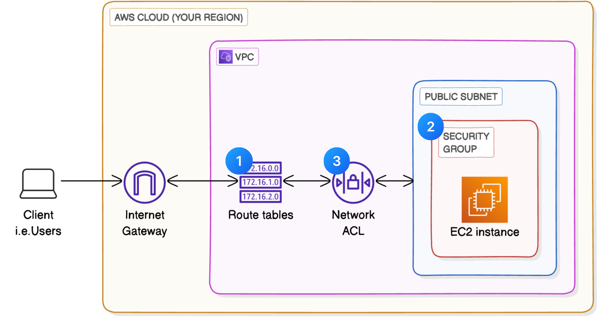

# AWS VPC Traffic Flow and Security Configuration

A hands-on project demonstrating VPC networking components with focus on security configurations.

## Project Highlights

- Configured VPC with public/private subnets
- Established route tables with internet gateway routing
- Implemented security groups for instance-level protection
- Configured network ACLs for subnet-level security
- Compared default vs custom security configurations

## Core Components Explained

### Route Tables
- Created custom route tables with internet gateway routes (`0.0.0.0/0 → igw-xxxx`)
- Associated route tables with appropriate subnets

### Security Groups
- Configured stateful firewall rules at instance level
- Allowed HTTP (port 80) inbound from any IP
- Maintained default allow-all outbound rules

### Network ACLs
- Implemented stateless subnet-level firewalls
- Compared permissive default ACL vs restrictive custom ACL
- Established rule numbering system for proper evaluation order

## Key Learnings

🔒 **Security Layers**: Discovered how security groups (instance-level) and network ACLs (subnet-level) provide defense in depth

🔄 **Stateful vs Stateless**: Security groups maintain connection state while network ACLs evaluate each packet independently

⏱️ **Configuration Impact**: Small changes to routing or security settings had immediate effects on connectivity

## Time Investment

⏳ Approximately 45 minutes for complete setup and verification

## Documentation

Detailed walkthrough available in [vpc-security-guide.pdf](vpc-security-guide.pdf)

## How to Replicate

1. Create VPC and subnets
2. Configure route tables with internet gateway
3. Set up security groups with needed rules
4. Adjust network ACLs as required
5. Test connectivity at each stage

## Visual Guide

  

## About the Author

**Vishnu Vardhan Gurram**  
Cloud Security Enthusiast | NextWork Student  

💻 [GitHub Profile](https://github.com/vishnuvardhan148)  

---

"Security is not a product, but a process." - Bruce Schneier
